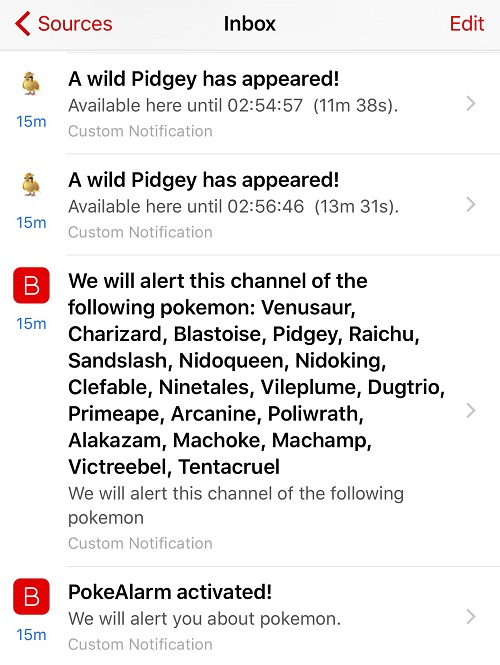

## Overview
* [Prerequisities](#prerequisities)
* [Introduction](#introduction)
* [Basic Config](#basic-config)
  * [Required Parameters](#required-parameters)
  * [Example: Basic Alarm Configuration using Required Parameters](#example-basic-alarm-configuration-using-required-parameters)  
* [Advanced Config](#advanced-config)
  * [Optional Parameters](#optional-parameters)
  * [Example: Alarm Configuration Using Optional Parameters](#example-alarm-configuration-using-optional-parameters) 
* [How to Get an API Key](#how-to-get-an-api-key)


## Prerequisites
This guide assumes 

1. You are familiar with [JSON formatting](http://www.w3schools.com/json/default.asp)
2. You have read and understood the [Alarm Configuration](https://github.com/kvangent/PokeAlarm/wiki/Alarm-Configuration) Wiki
3. You are comfortable with the layout of `alarms.json`.

Please familiarize yourself with all of the above before proceeding.

## Introduction


**Boxcar** is a cross-platform universal notifcation tool available on iOS, Android, and PhoneGap.

PokeAlarm offers the following for Boxcar:
* High resolution icons for pokemon, gym, and pokestop notifications
* Custom notification tones
* Personalized notifications via [Dynamic Text Substitution](Dynamic-Text-Subsitution.md)

## Basic Config

### Required Parameters
These `alarms.json` parameters are required to enable the Boxcar alarm service:

| Parameters            | Description                                             |
| --------------------- |---------------------------------------------------------|
| type                  | must be `boxcar`                                        |
| active                | `True` for alarm to be active                           |
| user_credentials      | Your access token/user credentials from Boxcar settings |

### Example: Basic Alarm Configuration using Required Parameters
```json
{
	"active":"True",
	"type":"boxcar",
	"user_credentials":"YOUR_ACCESS_TOKEN",
}
```
**Note:** The above code is to be inserted into the alarms section of alarms.json. It does not represent the entire alarms.json file.

## Advanced Config

### Optional Parameters
In addition to the 3 required parameters, several optional parameters are available to personalize your Boxcar notifications. Below is an example of these optional parameters and how they are incorporated into a functional alarm layout for Boxcar.

These optional parameters, `startup_message`, `startup_list`, and `sound`, are entered at the same level as `"type":"boxcar"`.

| Parameters      | Description                                | Default                                         |
|:--------------- |:-------------------------------------------|:------------------------------------------------|
|`startup_message`| Notification message upon startup          | `True`                                          |
|`startup_list`   | Enable pokemon list message  upon startup  | `True`                                          |
|`sound`          | The [notification tone](http://help.boxcar.io/support/solutions/articles/6000004813-how-to-send-a-notification-to-boxcar-for-ios-users) from Boxcar          | `beep-crisp`                                           |

#### Optional Pokemon Parameters
These optional parameters below are applicable to the `pokemon`, `pokestop`, and `gym` sections of the JSON file.

| Parameters      | Description                                 | Default                                       |
|:--------------- |:--------------------------------------------|:--------------------------------------------------|
|`title`          | Title for the message                       | `A wild <pkmn> has appeared!`        |
|`long_message`   | Additional text to be added to the message  | `Available <a href='<gmaps>'>here</a> until <24h_time> (<time_left>).` |

#### Optional Pokestop Parameters
| Parameters      | Description                                 | Default                                       |
|:--------------- |:--------------------------------------------|:--------------------------------------------------|
|`title`          | Title for the message                       | `Someone has placed a lure on a Pokestop!`        |
|`long_message`   | Additional text to be added to the message  | `<a href='<gmaps>'>This lure</a> will expire at <24h_time> (<time_left>).` |

#### Optional Gym Parameters
| Parameters        | Description                                 | Default                                       |
|:----------------- |:--------------------------------------------|:----------------------------------------------|
|`title`            | Title for the message                       | `A Team <old_team> gym has fallen!`           |
|`long_message`     | Additional text to be added to the message  | `<a href='<gmaps>'>Gym</a> is now controlled by <new_team>.` |

### Example: Alarm Configuration Using Optional Parameters
```json
{
	"active":"True",
	"type":"boxcar",
	"user_credentials":"YOUR_ACCESS_TOKEN",
	"startup_message":"True",
	"startup_list":"True",
	"pokemon":{
		"title":"A wild <pkmn> has appeared!",
		"long_message":"Available <a href='<gmaps>'>here</a> until <24h_time> (<time_left>).",
	},
	"pokestop":{
		"title":"Someone has placed a lure on a Pokestop!",
		"long_message":"<a href='<gmaps>'>This lure</a> will expire at <24h_time> (<time_left>).",
	},
	"gym":{
		"title":"A Team <old_team> gym has fallen!",
		"long_message":"<a href='<gmaps>'>Gym</a> is now controlled by <new_team>.",
	}
}
```
**Note:** The above code is to be inserted into the alarms section of alarms.json. It does not represent the entire alarms.json file.

## How to Get an API Key

1. Install [Boxcar](https://boxcar.io/client) on your iOS device and create an account. 

2. Go into settings.  Tap "Copy to clipboard" below the "Access Token".  This is your user_credentials